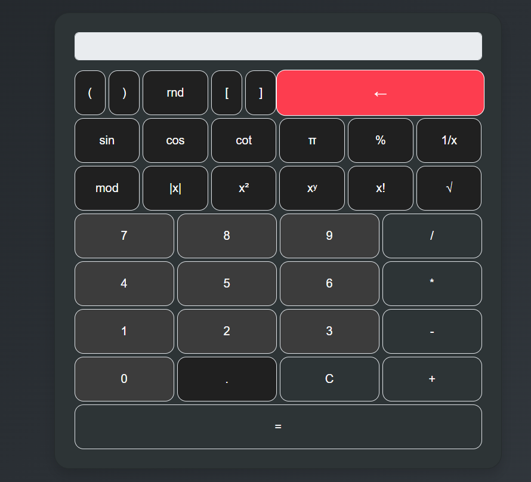

# 📱 Calculator Application

This project is a calculator application made using **Vanilla JavaScript**, **Bootstrap**, and **CSS**. It performs both basic and scientific calculations, and the design is especially focused on **mobile responsiveness**.

## 🚀 Features

- **Basic Calculations**: Addition, subtraction, multiplication, division operations.
- **Scientific Calculations**:
  - **Exponentiation (xʸ)**: Raising a number to a power.
  - **Reciprocal (1/x)**: Finding the reciprocal of a number.
  - **Factorial (x!)**: Calculating the factorial of a number.
  - **Absolute Value (|x|)**: Finding the absolute value of a number.
  - **Constants**: Pi (π) and Euler's number (e).
- **Mobile-Friendly Design**: Optimized for easy use even on small screens using **Bootstrap**.
- **Keyboard Support**: You can perform calculations using the keyboard by quickly entering numbers and operators.

## ⚙️ Technologies Used

The following technologies were used in this project:

- **HTML5**: Provides the structure of the application.
- **CSS3**: Defines the styles of the application.
- **JavaScript**: Handles the calculation operations and functions (Vanilla JavaScript, meaning no external libraries were used).
- **Bootstrap**: A framework for responsive (mobile-friendly) design, making the UI fast and adaptable.

## 📸 Screenshot

Here is the general view of the application:



## 🛠️ Installation

To run the project on your local machine, follow these steps:

1. Clone the repository to your computer:
   ```bash
   git clone https://github.com/fpektas98/Calculator.git
2. Navigate to the project folder:
   ```bash
   cd Calculator
3. Open the index.html file in a browser to run the application.

🎯 **Usage**
- **Performing Calculations:**
   - For basic calculations (addition, subtraction, multiplication, division), select numbers and the operation, and view the result.
- **Scientific Functions:**
  - To access scientific functions, click the scientific mode button at the top right of the app to reveal additional functions.
  - Use exponentiation (xʸ), reciprocal (1/x), factorial (x!), and absolute value (|x|) functions.
- **Mobile Use:**
  - Thanks to Bootstrap, the application is responsive and adapts to all screen sizes, making it easy to use on smaller screens.
- **Keyboard Support:**
  - You can perform calculations using your keyboard by quickly entering numbers and operators. 
📦 **Packages**
This project does not use any external libraries or packages, only Bootstrap for responsive design.

📚 Contribution If you'd like to contribute to this project, follow these steps:
-Fork this repository.
-Create a new branch.
-Make your desired changes.
-Commit your changes and create a pull request.

💬 Contact If you have any questions about this project or would like to provide suggestions, feel free to contact me.
   
